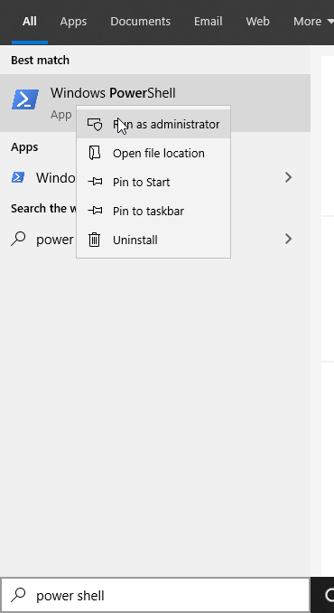
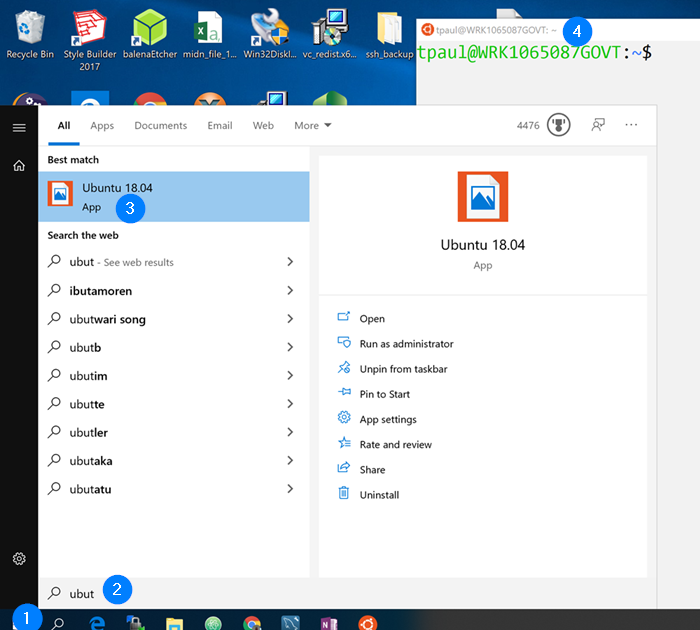

# Instructions before and after running install.sh

This README provides instructions for cloning this GIST and making the minor changes
you need to make to `install.sh` before running the script.

## 1) Choose where you install (WSL vs Linux VM)

You can install this LAMP stack inside of your CS VM, or you can install the **Windows
Subsystem for Linux (Recommended)** on any Windows 10 machine (you might have to run Windows update
  if it has not been run for a while, Academy laptops will be good to install!).

If you are using your VM you can skip these steps:

1. Run Power Shell as an administrator. Press the Windows Key, type "powershell", right click and run as administrator:



2. Enable WSL by running the following Command:

`Enable-WindowsOptionalFeature -Online -FeatureName Microsoft-Windows-Subsystem-Linux`

3. Restart your machine if prompted!

4. See *Step 1* to open PowerShell as administrator again and then run (NOTE: After running, you will see Number of bytes written and it will take 2-3 mins to complete):

`Invoke-WebRequest -Uri https://aka.ms/wsl-ubuntu-1804 -OutFile Ubuntu.appx -UseBasicParsing`

5. Run the following in the *administrator PowerShell terminal*, follow any instructions for creating your user account, choosing a password (will be used for `sudo`, etc. in WSL), and restarting if prompted:

`Add-AppxPackage .\Ubuntu.appx `

6. You should be left with a WSL (BASH) terminal after the install completes or press the windows key and type "ubuntu". Clicking the `Ubuntu App` should open a BASH terminal:



Congratulation! You may never need your CS VM again! You are ready to proceed to the `install.sh` script, but first a few notes on WSL:

* It is a lightweight Linux distribution designed in collaboration with Microsoft and Canonical. It has access to most (I've never bumped into one that isn't available, although sometimes features are limited) Linux packages.
* It has access to your Windows file system! Run:

```
Format:
cd /mnt/<Drive Letter>/Users/m<YOUR_ALPHA>

Example:
cd /mnt/c/Users/m115106
```
* It has access to your Computers resources without partitioning them like you must for a VM.
* You can host a webserver to run your LAMP stack in WSL and access it via Chrome on Windows!

## 2) Clone this GIST:

In your WSL/VM terminal, navigate to the directory you want to clone this GIST in and run (NOTE: for WSL users it is recommended you clone any repos you want to edit in Atom/your favorite editor on Windows in the proper directory on the Windows drive, i.e. `/mnt/c/Users/m<YOUR_ALPHA>/Documents`):

```
git clone https://gist.github.com/bb5d7f33739f0837446e358afae67665.git LAMP_script

cd LAMP_script
```

## 3) Update necessary variables in install.sh:
